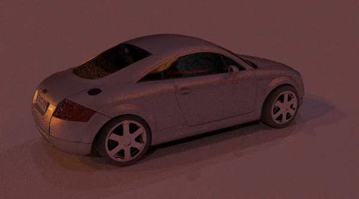

# Median Cut Implementation

This branch contains the infinite light which implements Paul Debevec's [A Median Cut Algorithm for Light Probe Sampling](https://vgl.ict.usc.edu/Research/MedianCut/) paper.

The main purpose of this paper is to divide the entire environment map into multiple subregions with nearly equal energy and place a light source in each subregion. These multiple light sources are then used to simulate the overall environment lighting.

# Steps

1. Create the sum area table using the pixel values[1] in the enviroment map.
2. Add the entire light probe image to the region list as a singleregion.
3. For each region in the list, subdivide along the longest dimension[2] such that its light energy is divided evenly[3].
3. If the number of iterations is less than `n`, return to step 2.
4. Place a light source at the center or centroid of each region,and set the light source color to the sum of pixel values within the region.

# Usage

The usage is same as the `infinite light` in pbrt-v3, but the only difference is you need to specify the `maxdepth` parameter.
- `maxdepth`(default=6): The entire region will be divided to 2^`maxdepth` subregions, the higher it is, the more accurate environment light it can simulate

Example:

```
LightSource "custom_infinite" "string mapname" ["textures/grace_latlong.exr"]
	"integer nsamples" [4] "integer maxdepth" [6] "spectrum L" [1, 1, 1]
```

# Notes

[1] Because we are mapping a texture to a sphere, make sure you scale the values by the unit sphere area.
[2] In the paper, it mentioned that you also need to scale the width when determine the cut axis, but in my experiment considering the latitude did not generate better result.
[3] Do binary search to find the cut can accelerate the calculation.

# Result

reference (pixelsamples=128):  


my implementation:  
|  maxdepth\pixelsamples  |  64  |  128  |  256  |
|  ----  |  ----  |  ----  |  ----  |  ----  |
|  3  |  |  |  |
|  4  |  |  |  |
|  5  |  |  |  |
|  6  |  |  |  |

# References

P. Debevec, [A Median Cut Algorithm for Light Probe Sampling](https://vgl.ict.usc.edu/Research/MedianCut/), SIGGRAPH 2006 Sketches and Applications.